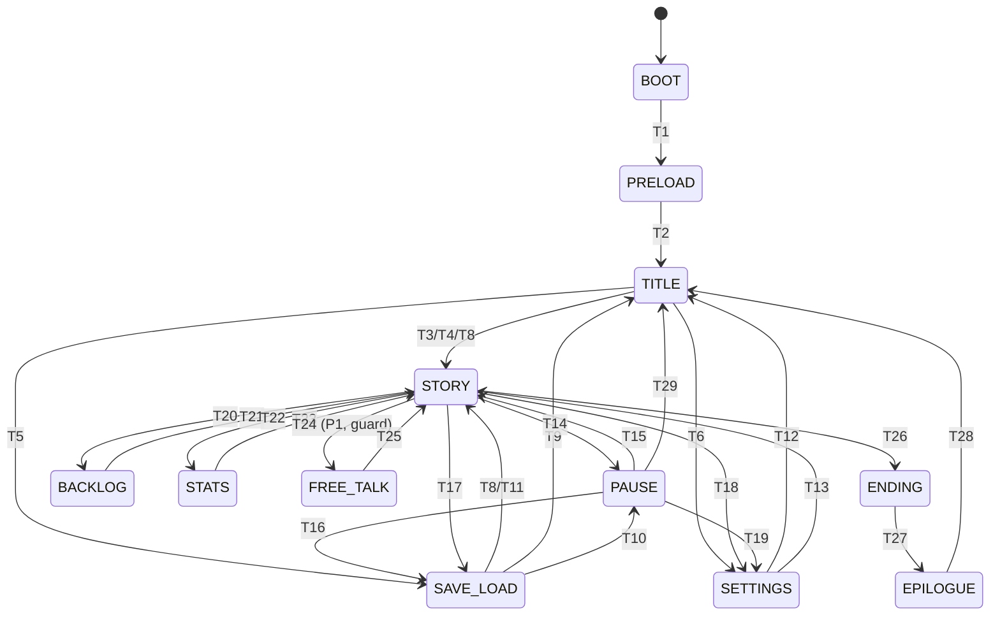

# SPEC.md — «МАЯК В НОЯБРЕ» (рабочее название)

Психологическая романтическая драма. Визуальная новелла. 2D. Web (GitHub Pages) + Android (Capacitor → APK).

**Единый источник правды.** Код обязан соответствовать этому документу. Любое отклонение —
либо правка кода, либо изменение SPEC.md (с версией).

Версия спеки: **1.1** · Дата: 2026-08-01

**История изменений**
- 1.1: пороги веток уточнены после смоук-прохода (автоплей): светлая концовка Марины —
  доверие ≥55/близость ≥55 (вместо 60/55, иначе была недостижима — баг найден тестом, не
  глазами). Светлая концовка — сознательно «золотой путь» (единственная цепочка выборов).
  Форк «уезжаю» единый: слова Штерну == подписанию сделки. Пороги и таймеры живут в
  `balance.ts`; дельты выборов — рядом с выбором в узлах (авторские значения).

---

## 0. Жёсткие рамки контента (не обсуждаются в коде)

- **Все персонажи — взрослые (18+), возраст указан явно.** Романтика — только взрослая и
  взаимная (consensual). Категорический возраст 18 проставлен у каждого персонажа в Codex.
- **Нет откровенного сексуального контента.** Максимум: взаимность, объятия, поцелуй,
  сцены «fade-to-black» за кадром.
- **Нет контента про владение людьми / «рабство».** Механики ухода/доверия реализуются
  как равные отношения двух взрослых людей, а не как опека над зависимым персонажем.
- **Ничего не копируется из референсов** (Saya no Uta, Determinable Unstable, Teaching
  Feeling): сюжет, персонажи, имена, арт и музыка — оригинальные. Референсы задают только
  тон (меланхолия, ненадёжный рассказчик, мрачная водная среда).
- **Никаких API-ключей в коде, репозитории и APK.** Ключ Gemini вводится пользователем
  на устройстве (Экран настроек) и хранится только в локальном хранилище устройства.

---

## 1. Дизайн-пиллары

1. **Выбор весит.** Каждое решение — это сдвиг статов, закрытие/открытие узлов истории и
   след в backlog'е. Концовки определяются накопленным состоянием, а не одним выбором.
2. **Город — третий персонаж.** Крюково (умирающий портовый город) реагирует на прогресс:
   погода, освещение, звук и случайные детали улиц меняются от статов и дня.
3. **Отношения — система, не прогресс-бар.** Два измерения на героиню (Доверие/Близость)
   плюс общий стат героя «Ясность» — комбинации, а не сумма, открывают сцены и концовки.

### Non-goals (чего в игре НЕ будет)

- Откровенных секс-сцен, NSFW-арта, несовершеннолетних персонажей.
- Геймплея «симулятора владельца» (никаких механик собственности над человеком).
- Мультиплеера, доната, рекламы, аккаунтов, аналитики/трекеров.
- ИИ-генерации сюжета в P0 (Gemini — отдельный опциональный режим P1, не влияющий на
  основную историю; игра полностью playable без интернета).
- Искусственного «раздувания» APK пустыми файлами ради веса.

---

## 2. Core loop (10–30 секунд)

```
Чтение сцены (текст/спрайты/фон/эмбиент)
  → реактивный выбор (2–4 варианта, иногда таймер 8 c — молчание тоже выбор)
  → мгновенный фидбек: изменение статов (анимация «Ясность ±N»), реплика-реакция
  → переход по узлу истории (ветвление) → новая сцена
```

Между «актами» — экран-«карта города»: игрок выбирает одну из 2–3 локаций дня
(риск: потратить день не на ту героиню; награда: уникальные сцены/статы).
Сохранение доступно в любой момент (кроме экрана концовки) — риск «потерять» прогресс ≈ 0.

**Награда:** новые узлы истории, CG-сцены, разблокировка концовок и галереи.
**Риск/вызов:** непоправимые выборы актов (маркер «●» в backlog), провал проверок
статов → горькие ветки; таймерные выборы под давлением.

---

## 3. Диаграмма состояний (КОНЕЧНЫЙ АВТОМАТ — контракт кода)

Стейт-машина `GameFlow` управляет состояниями. **В коде не должно быть состояний или
переходов, которых нет здесь.**

### Состояния

| ID | Название | Экран/сцена Phaser | Входной сценарий |
|----|----------|--------------------|-------------------|
| S1 | `BOOT` | BootScene | Старт приложения: чтение настроек/прогресса из storage, выдача `meta` |
| S2 | `PRELOAD` | PreloadScene | Прогресс-бар; загрузка арта/шрифтов; валидация сохранений (checksum) |
| S3 | `TITLE` | TitleScene | Меню: Новая игра / Продолжить* / Загрузить / Настройки / Выход(APK) |
| S4 | `STORY` | StoryScene | Основной экран: диалоги, выборы, карта города |
| S5 | `PAUSE` | PauseOverlay (поверх STORY) | Меню: Продолжить / Сохранить / Загрузить / Настройки / Титул |
| S6 | `SAVE_LOAD` | SaveLoadOverlay (поверх STORY/PAUSE или из TITLE) | 9 слотов + quicksave + autosave; режимы save/load |
| S7 | `SETTINGS` | SettingsOverlay (поверх) или из TITLE | См. раздел 7 |
| S8 | `BACKLOG` | BacklogOverlay (поверх STORY) | Последние 100 реплик; переигровка голоса — P2, в P0 только текст |
| S9 | `STATS` | StatsOverlay (поверх STORY) | Ясность + 2 шкалы на каждую героиню + «напряжение дня» |
| S10 | `ENDING` | EndingScene | Карточка концовки (ID, CG, название) → запись в реестр концовок |
| S11 | `EPILOGUE` | EpilogueScene | 1–3 кадра послетекста; затем TITLE |
| S12 | `FREE_TALK` | FreeTalkScene (P1, Gemini) | Свободный разговор с героиней; недоступна без ключа — гейт |

*«Продолжить» кликабельна только при наличии валидного autosave/quicksave.

### Переходы (полный список; `---→` = всегда, `--[guard]→` = условие)

| # | От | К | Триггер | Условие / действие |
|---|-----|---|---------|--------------------|
| T1 | BOOT | PRELOAD | init-ok | meta загружено; иначе создать дефолт |
| T2 | PRELOAD | TITLE | загрузка 100% | все ассеты валидны; сохранения проверены |
| T3 | TITLE | STORY | «Новая игра» | новый StoryState с узла `act0_start` |
| T4 | TITLE | STORY | «Продолжить» | autosave/quicksave валиден → снято с узла сохранения |
| T5 | TITLE | SAVE_LOAD | «Загрузить» | режим `load`, источник `title` |
| T6 | TITLE | SETTINGS | «Настройки» | источник `title` |
| T7 | TITLE | — | «Выход» (только APK) | Capacitor App.exitApp(); в вебе пункт скрыт |
| T8 | SAVE_LOAD | STORY | слот выбран | загрузка снапшота → узел из снапшота |
| T9 | SAVE_LOAD | TITLE | «Назад» (источник=title) | — |
| T10 | SAVE_LOAD | PAUSE | «Назад» (источник=pause) | — |
| T11 | SAVE_LOAD | STORY | «Назад» (источник=story) | закрыть оверлей |
| T12 | SETTINGS | TITLE | «Назад» (источник=title) | применить + persist |
| T13 | SETTINGS | STORY | «Назад» (источник=story/pause) | применить + persist, закрыть оверлей |
| T14 | STORY | PAUSE | Esc / кнопка ☰ / системная «назад» | время истории ставится на паузу |
| T15 | PAUSE | STORY | «Продолжить» / «назад» | — |
| T16 | PAUSE | SAVE_LOAD | «Сохранить»/«Загрузить» | режим save/load, источник `pause` |
| T17 | STORY | SAVE_LOAD | quick-меню «Save»/«Load» | режим save/load, источник `story` |
| T18 | STORY | SETTINGS | quick-меню ⚙ | источник `story` |
| T19 | PAUSE | SETTINGS | «Настройки» | источник `pause` |
| T20 | STORY | BACKLOG | жест вверх / quick-меню «Журнал» | — |
| T21 | BACKLOG | STORY | «назад»/тап вне | — |
| T22 | STORY | STATS | quick-меню 📊 | — |
| T23 | STATS | STORY | «назад»/тап вне | — |
| T24 | STORY | FREE_TALK | разговорный узел `free_talk` | ключ задан И интернет есть; иначе узел пропускается |
| T25 | FREE_TALK | STORY | «Завершить разговор» | итог пишется в backlog 1 строкой-сводкой |
| T26 | STORY | ENDING | узел типа `ending` | ID концовки заносится в реестр |
| T27 | ENDING | EPILOGUE | тап / «Далее» | — |
| T28 | EPILOGUE | TITLE | завершение | autosave помечается `finished` |
| T29 | PAUSE | TITLE | «Титул» (+подтверждение, если есть несохр. выборы текущего узла) | время истории сброшено |
| T30 | любая overlay-сцена | нижележащая | системная «назад» | см. карту back в §7 |
| T31 | STORY | STORY | внутренние переходы узлов (jump/if/choice/map) | это **не** смена состояния |

### Правила железные

- Оверлеи S5–S9 могут быть открыты **по одному**; повторный вызов того же оверлея = закрытие.
- `STORY` никогда не уничтожается при открытии оверлеев (сцена спит, не удаляется).
- Системная «назад» никогда не закрывает приложение из S4–S11 без промежуточного оверлея.
- Из `ENDING/EPILOGUE` загрузка/настройки недоступны (чистый финальный проход).



---

## 4. Сюжет и персонажи (оригинальные)

**Алекс Морозов, 28.** Звукорежиссёр из столицы. Возвращается в портовый городок
Крюково продать дом покойного отца и уехать навсегда. Город держит его: нотариус
тормозит сделку, осень давит, а по ночам с маяка звучит старая радиочастота, которую
Алекс в детстве записывал на кассету.

- **Марина Ветрова, 27** — смотрительница маяка и ведущая ночного радио «Ноль метров».
  Прагматичная, резкая, скрывает, почему семь лет не выезжает из города. Статы:
  Доверие, Близость.
- **Дарья Ржевская, 26** — нотариус, подруга детства Алекса. Ведёт его дело о доме.
  Тёплая и собранная снаружи; внутри — долги, чужие обещания и её собственная цена
  вопроса. Статы: Доверие, Близость. (Полная ветка — P1.)
- **Аркадий Штерн, 55** — механик порта, друг отца. Держит третью сторону истории.

**«Ясность» Алекса** — ментальный стат (0–100). Падает от избегания и бессонницы,
растёт от честных разговоров и дел. При Ясности < 30 мир визуально искажается
(глитчи композиции, «плывущие» тексты интерфейса — эффект, не контент) и часть
выборов становится недоступна.

**Структура:** Пролог + 3 акта. Узел-карта города в начале каждого акта-дня.
Концовки (цель полной игры ≥7): по 3 на каждую героиню (светлая / горько-сладкая /
плохая) + соло-концовка «Отчалить». **P0-минимум: Пролог + Акт 1–3 ветки Марины
(3 концовки) + соло-концовка.**

---

## 5. Фичи: P0 / P1 / P2

### P0 — без этого игра не игра
| ID | Фича | Критерий готовности |
|----|------|---------------------|
| E1 | Скриптовый движок истории | Узлы TS-формата: `say/choice/jump/set/if/bg/sprite/audio/map/ending/timed_choice`; детерминированный `StoryEngine`; unit-тесты ядра |
| E2 | Статы и проверки | Ясность + Доверие/Близость ×2 героини; `if`-узлы по порогам; экран STATS (S9) |
| E3 | Полный контент ветки Марины + соло | Пролог + 3 акта, ≥150 узлов, 3 концовки Марины + «Отчалить», карта города с выбором локаций |
| E4 | Главное меню и флоу | TITLE/PRELOAD/BOOT/ENDING/EPILOGUE по автомату §3 |
| E5 | Сохранения | 9 слотов + quicksave + autosave; schema v1 + checksum; валидация при запуске; восстановление после битого слота |
| E6 | Quick-меню STORY | Журнал / Auto / Skip(только прочитанное) / Save / Load / Настройки / Титул |
| E7 | Backlog | 100 последних реплик с кем и когда (день/акт) |
| E8 | Настройки | Скорость текста, скорость auto, громкости (мастер/эмбиент/эффекты), прозрачность окна текста, «снижение эффектов» (accessibility для глитчей), fullscreen(web) |
| E9 | Процедурный аудио-движок | WebAudio-синтез эмбиента (дождь/море/ветер/радио-помехи) и UI-щелчков **без аудиофайлов**; ни одного .mp3/.ogg в P0 |
| E10 | Арт (оригинальный, сгенерированный) | ≥8 фонов, ≥2 героини × ≥3 позы, титул-арт, 4 CG (по одной на концовку Марины + соло) |
| E11 | Пауза/оверлеи/نавигация «назад» | Полный автомат §3 включая Android back |
| E12 | Сборка и запуск | `npm run dev/build` зелёные; игра проходима от «Новая игра» до любой концовки без ошибок консоли; unit-тесты движка зелёные |
| E13 | Capacitor-готовность | Конфиг `capacitor.config.ts`, `npm run build` кладёт веб-бандл в `www/` для `npx cap add android` |

### P1 — второй проход
| ID | Фича |
|----|------|
| F1 | Ветка Дарьи: полные Акты 2–3, 3 концовки, пересечения с веткой Марины |
| F2 | FREE_TALK (S12): Gemini-чат с героиней. Ключ вводится в Настройках вручную и хранится локально; системный промпт фиксирует взрослый, уважительный, неявный тон; история чата не сохраняется; офлайн = узел пропускается |
| F3 | Галерея CG + реестр концовок (экран из TITLE) |
| F4 | Процедурная погода/освещение фона от статов и дня (шейдерный тинт + партиклы дождя) |
| F5 | Таймерные выборы (8 c) в ключевых узлах актов 2–3 |

### P2 — если останется время
| ID | Фича |
|----|------|
| G1 | Достижения (локальные, 12 шт.) |
| G2 | Переименование героя (дефолт «Алекс») в настройках |
| G3 | Экран «Крюково в записях» — коллекция найденных звуков/записок |
| G4 | Ещё 2 CG на ветку Марины |
| G5 | Экспорт/импорт сохранений файлом |

---

## 6. Технические рамки

| Параметр | Значение |
|----------|----------|
| Движок | Phaser 3 (пинованная версия из npm, фиксируется при установке) + TypeScript |
| Сборка | Vite; вывод в `dist/` (web) и `www/` (Capacitor) |
| Мобильная обёртка | Capacitor (пинованная версия); `npx cap add android` на стороне пользователя |
| Android | minSdk 23 (Android 6.0), targetSdk 35 |
| Разрешение дизайна | 1280×720, `Scale.FIT` + центровка; safe-area для 18:9/19.5:9/20:9 |
| FPS | цель 60 (статичные сцены), допустимо 30 на партиклах |
| APK | реалистично 25–80 МБ с артом P0; 100–300 МБ достижимо только за счёт HD-арт/CG-наборов и озвучки — решение принимает заказчик, мусором не добиваю |
| Офлайн-режим | игра playable целиком, кроме FREE_TALK |
| Хранилище | localStorage (web) / Preferences (APK) через адаптер `StoragePort` |
| Деплой web | GitHub Pages: папка `game/` как dist-артефакт; APK публикуется через GitHub Releases |

### Проверка наличия технологий (Этап 0, факт)
- Node v22.22.3, npm 10.9.8 — есть; интернет до npm registry — есть.
- Java/Gradle/Android SDK/эмулятор — **нет в песочнице** → APK собирается пользователем
  в Android Studio по инструкции (Этап 4). Я честно не могу собрать APK здесь.

---

## 7. Поведение платформы (контракт для Этапа 3)

- **Системная «назад»:** TITLE→(диалог выхода в APK / ничего в web); STORY→PAUSE;
  любой оверлей→закрыть оверлей; ENDING→EPILOGUE; EPILOGUE→TITLE; FREE_TALK→STORY.
  Ни один «назад» не выбрасывает из приложения без подтверждения.
- **Сворачивание/возврат:** auto-pause в PAUSE (если в STORY) + autosave в приоритетном
  слоте; аудио глушится; при возврате — продолжение из PAUSE.
- **Поворот экрана:** ориентация залочена landscape (APK); в web — letterbox FIT.
- **Слабые устройства:** партиклы и фильтры отключаются настройкой «снижение эффектов»;
  авто-деградация при fps < 25 в течение 3 c (лог + понижение качества).
- **Память:** каждая сцена освобождает текстуры CG вне видимости; цель < 350 МБ RSS.

---

## 8. Структура кода (план)

```
game/
  index.html·vite.config.ts·package.json·capacitor.config.ts
  src/
    main.ts                 — точка входа, конфиг Phaser
    core/flow.ts            — GameFlow: автомат §3, единственный владелец переходов
    core/storyEngine.ts     — детерминированный интерпретатор узлов
    core/storyTypes.ts      — типы узлов (say/choice/if/set/jump/bg/sprite/audio/map/ending)
    core/stats.ts           — Ясность/Доверие/Близость + пороги
    core/save.ts            — слоты 9+quick+auto, schema v1, checksum, миграции
    core/storage.ts         — StoragePort (localStorage/Preferences)
    core/backlog.ts         — журнал 100 реплик
    core/rng.ts             — детерминированный PRNG (seed в сейве)
    audio/procedural.ts     — синтез дождь/море/ветер/радио/UI-хуки
    scenes/…                — BootScene, PreloadScene, TitleScene, StoryScene,
                              PauseOverlay, SaveLoadOverlay, SettingsOverlay,
                              BacklogOverlay, StatsOverlay, EndingScene, EpilogueScene
    ui/                     — textbox, choicebox, quickmenu, sliders, toasts
    content/story/marina.act0..3.ts, solo.ts, common.ts  — контент-узлы
    content/balance.ts      — ВСЕ пороги/стоимости/таймеры (никаких магических чисел в сценах)
    net/gemini.ts           — P1: клиент, ключ только из настроек
  assets/art/…              — сгенерированные фоны/спрайты/CG
  tests/                    — unit-тесты storyEngine/save/stats (jest)
```

**Контракт «никаких TODO»:** функция либо реализована и покрыта запуском, либо не
подключена к флоу и явно помечена в отчёте среза как отсутствующая.

---

## Приложение A. Статус реализации (после срезов P0, 2026-08-01)

P0 выполнен по E1–E13 с одним честным отклонением: в E10 из 6 запланированных портретов
сгенерированы 3 (Марина) — упёрся в лимит генерации изображений 10/сессия; отсутствие
файлов обрабатывается манифестом (сцены без битых ссылок), догенерация портретов
Дарьи/Штерна и отдельных CG — первым пунктом P1. Проверки: 11/11 unit, автоплей
(все 4 концовки достижимы), E2E 23/23 в headless Chromium, `tsc --noEmit` чист,
`vite build` зелёный, консоль рантайма без ошибок.
